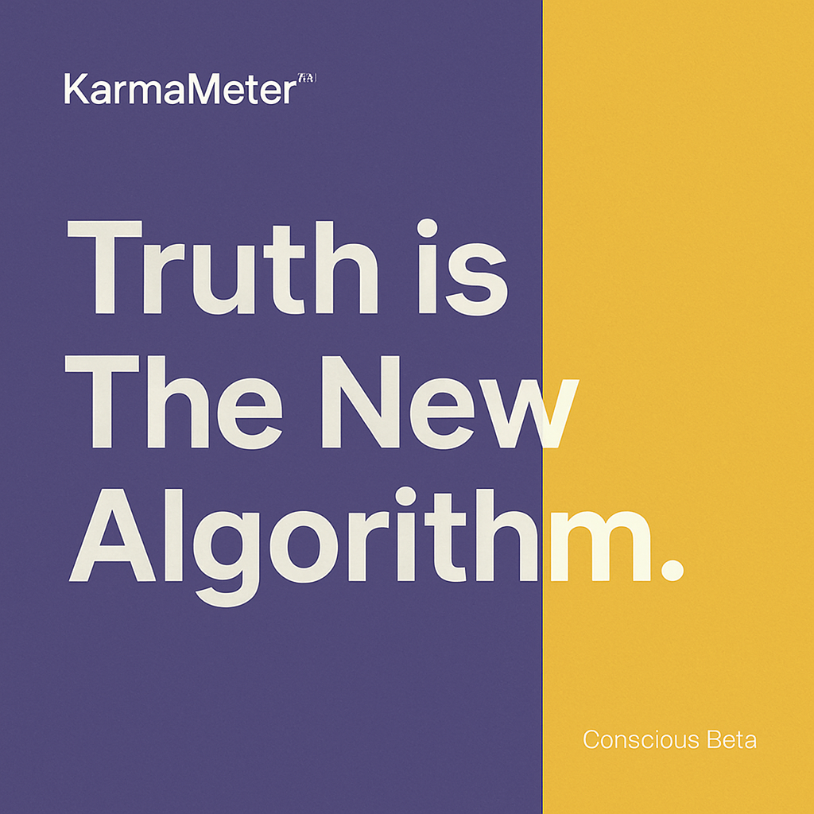

# KarmaMeter – A Truth & Positivity Engine for Group Chats

> *“Truth is the New Algorithm.”*  
> 🧘 KarmaMeter is in **Conscious Beta** – a purpose-driven open-source tool for digital well-being, clarity, and conscious communication.

> ⚠️ **Legal Notice: Protected for Non-Commercial Use Only**
>
> **KarmaMeter™** is a non-commercial, open-source initiative created solely for societal well-being, emotional clarity, and conscious communication.
>
> **You are *not allowed* to use any part of this project — including its name, algorithmic concepts, summaries, sentiment/truth filters, or visual identity — for commercial or profit-making purposes.**
>
> This includes (but is not limited to):
> - Selling apps or services based on KarmaMeter™  
> - Embedding KarmaMeter features in commercial products  
> - Using KarmaMeter-generated scores or visualizations for paid offerings  
> - Claiming ownership or sublicensing any part of this work
>
> To discuss fair use, educational collaborations, or spiritual alliances, please contact the author at **karmameter.global@gmail.com**.
>
> 🧘 KarmaMeter is **open-source**, not **open-for-exploitation**.

---

**KarmaMeter** is an open-source project built to **measure and elevate the spiritual, emotional, and ethical quality of digital communication**, focusing on **group chats** (like WhatsApp, Telegram) and **other social media platforms**. It aims to foster conscious communication and positivity in all forms of online interaction.

It uses principles of:
- 📊 Sentiment analysis  
- 🧠 Truthfulness estimation  
- 🧘‍♀️ Collective consciousness modeling  
- ✨ Factual summarization and negativity filtering  

to compute a **karma score** and enhance the quality of messages and group interactions.

---

## 🌱 Vision & Purpose

This project aims to:
- Encourage conscious communication  
- Track digital positivity  
- Reward truthfulness & emotional harmony  
- Promote clarity through summarization and the removal of toxic patterns  

KarmaMeter is not a product — it is a **tool for positive transformation and public good**.

---

## 🛠️ How It Works

1. **Message parsing** from chat exports or APIs  
2. **Sentiment & truth scoring** using NLP and user-trained models  
3. **Karma score generation** per message, user, and group  
4. **Factual summarization** of message threads to highlight meaningful insights and reduce noise  
5. **Negativity filtering** to detect and flag harmful, false, or divisive content  
6. **Visualizations** of group health and positivity over time  

Coming soon: a web dashboard, browser extension, and mobile integrations.

---

## 🧪 Core Innovation Highlight

**✨ Factual & Truth-Centered Filtering Engine**

KarmaMeter introduces a new layer of intelligence that:
- Automatically **summarizes key informative points** from long or cluttered chats  
- Detects and filters **emotionally manipulative or misleading content**  
- Encourages users to communicate with **truth, clarity, and peace**  
- Is inspired by a vision of **Satyug** – an age of universal truth and dharma

---

## 🔒 Private Algorithm Notice

**Certain core components of KarmaMeter, such as the summarizer and emotion-filter algorithms, are currently withheld** to maintain the integrity and ethical standards of the project. These algorithms are critical to the unique functionality of KarmaMeter and will be made available **under specific conditions** to contributors or partners who align with the project's mission and ethical guidelines.

To access the private parts of the code or discuss potential collaborations, please contact the project maintainer at **karmameter.global@gmail.com**.

---

## 👨‍💻 Developed by

**Dhanesh Sanjeev Tatuskar**  
Open-source researcher & digital well-being advocate  
📧 karmameter.global@gmail.com

---

## 💡 Non-Commercial Use

KarmaMeter is provided **strictly for non-commercial use**.  
To use it commercially, reach out via the contact above.

---

## 📄 Media & Content License

All non-code content in this repository — including but not limited to:
- Documentation files  
- Visual assets and UI mockups  
- Branding elements (e.g., logo, banners)  
- Educational materials or social media content  

is licensed under the **Creative Commons Attribution-NonCommercial-ShareAlike 4.0 International (CC BY-NC-SA 4.0)** license, **unless otherwise noted**.

🔗 [Read the full license](https://creativecommons.org/licenses/by-nc-sa/4.0/)

---

## 📜 Source Code License

The source code in this repository is licensed under the  
**GNU Affero General Public License v3 (AGPLv3)**  
🔗 [Read AGPLv3 License](https://www.gnu.org/licenses/agpl-3.0.html)

---

## 🛡️ Legal & Licensing Documents

- 📜 [Contributor License Agreement (CLA.md)](CLA.md)  
- 📘 [Branding & Trademark License (branding_license.md)](branding_license.md)  
- 📎 [Third-Party Licenses (third_party_licenses.md)](third_party_licenses.md)

---

## 📱 Follow Us

Stay connected and join the conversation on our social media:
- **X (formerly Twitter)**: [@KarmaMeterOrg](https://x.com/KarmaMeterOrg)
- **Instagram**: [@karmameter_official](https://instagram.com/karmameter_official)
- 🌐 Follow KarmaMeter on Facebook: *Coming soon!*  
- 🌐 Follow KarmaMeter on LinkedIn: *Coming soon!*

---

## 🙏 Contribute to the Positive Change

You’re welcome to:
- Suggest ideas  
- Improve the models  
- Build integrations  

Please contribute **non-commercially** and with the spirit of **positive transformation**.

Thank you for helping spread positivity! ✨

---

## © Copyright

KarmaMeter is © 2025 Dhanesh Sanjeev Tatuskar. All rights reserved.  
All trademarks, including "KarmaMeter" and associated visuals, are protected under common law trademark rights and evolving conscious use guidelines.

🌀 The KarmaMeter visual identity is a **conscious trademark**, currently in **open spiritual development**.

---

## 🧭 For MIT Solve & Public Interest Orgs

This project is submitted in the spirit of open-source innovation, collective well-being, and public benefit.  
We invite ethical collaborations, mentorship, and alliances to scale KarmaMeter responsibly and consciously.
